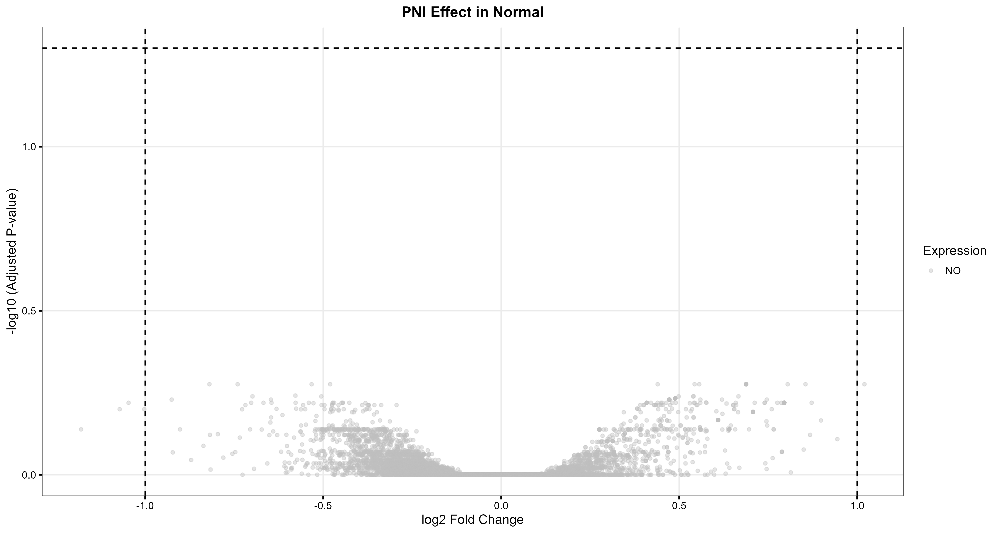
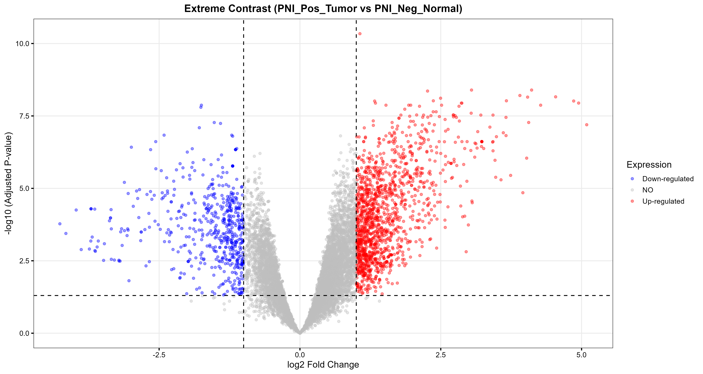
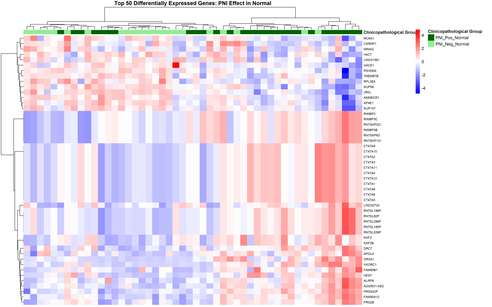
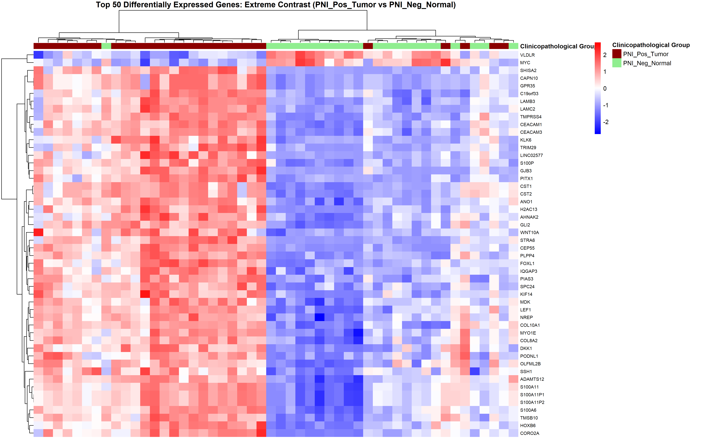
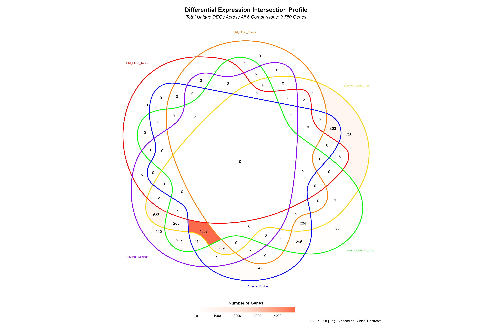
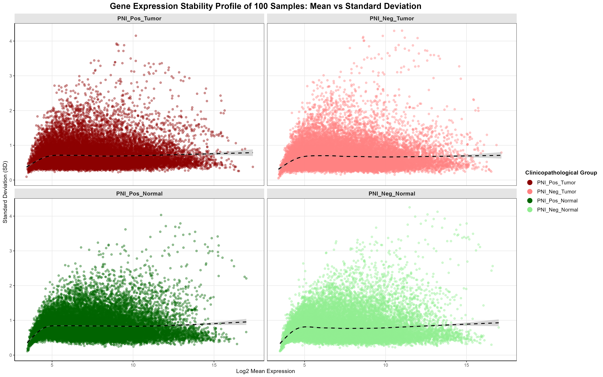
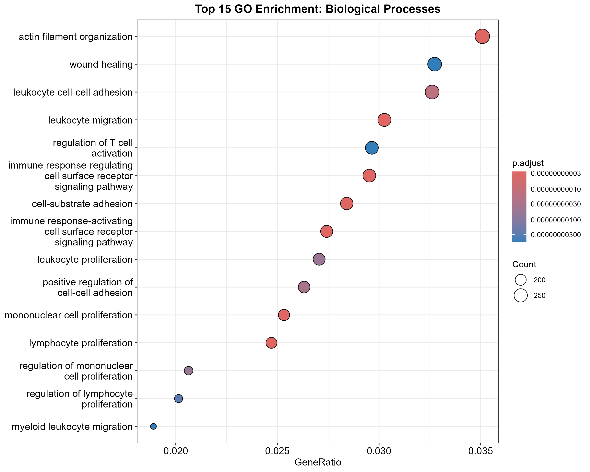
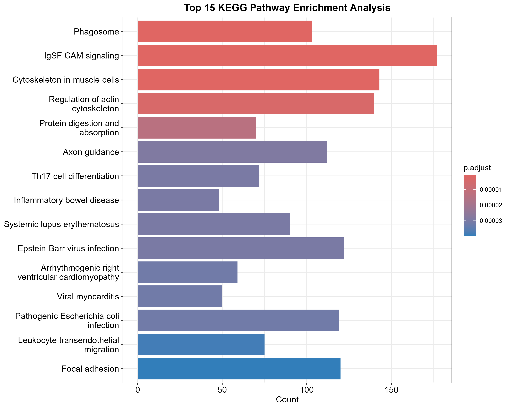

## 📜 Copyright & Licensing
> [!CAUTION]
> **Academic Integrity & Copyright Notice**.
> 
> This project, including all R scripts, datasets, and visualizations, is the academic work of **Yosia Jose Rasdiva Manurung**. 
> Unauthorized use, reproduction, or redistribution of this content for commercial purposes or academic submission by others is **strictly prohibited**. For permissions or collaboration, please contact the author.  

# Integrative Transcriptomic Profiling of Perineural Invasion (PNI) Signatures in Pancreatic Ductal Adenocarcinoma (PDAC): a Multi-Contrast Bioinformatics Study
**Author:** Yosia Jose Rasdiva Manurung  
**Affiliation:** Diponegoro University  

---

## 1. Research Objectives & Comparison Groups
The primary goal of this study is to identify Differentially Expressed Genes (DEGs) across **six PNI-related clinical contrasts**. This systematic approach allows me to isolate the specific transcriptomic signatures driven by neural invasion versus those driven by general tumorigenesis.

### Contrasts Explored:
1.  **PNI Effect (Tumor):** PNI-positive Tumor vs. PNI-negative Tumor
2.  **PNI Effect (Normal):** PNI-positive Normal vs. PNI-negative Normal
3.  **Tumor vs. Normal (+):** PNI-positive Tumor vs. PNI-positive Normal
4.  **Tumor vs. Normal (-):** PNI-negative Tumor vs. PNI-negative Normal
5.  **Extreme Contrast:** PNI-positive Tumor vs. PNI-negative Normal
6.  **Reverse Contrast:** PNI-negative Tumor vs. PNI-positive Normal

---

## 2. Project Overview
Pancreatic Ductal Adenocarcinoma (PDAC) progression is heavily influenced by **Perineural Invasion (PNI)**. This study utilizes the **GSE102238** dataset (100 samples) to map the molecular crosstalk between malignant cells and the peripheral nervous system.

Pancreatic Ductal Adenocarcinoma (PDAC) is one of the most aggressive malignancies worldwide, characterized by late-stage diagnosis and high therapeutic resistance. A defining hallmark of its progression is **Perineural Invasion (PNI)**—a process where cancer cells infiltrate the neural network, driving debilitating pain and clinical recurrence.

Rather than simple physical infiltration, PNI represents a complex molecular reprogramming of the tumor microenvironment (TME) [Chen et al. (2023); Sarantis et al. (2020); Sun et al. (2024)]. This study utilizes the **GSE102238 dataset** [Yang et al. (2020)] to systematically map the bidirectional signaling loop between malignant cells and the peripheral nervous system, aiming to identify unique transcriptomic signatures that could serve as novel therapeutic targets.

## 3. Methodology & Workflow

The analysis was conducted using **R (v4.5.2)**. The integrated pipeline combines data acquisition, rigorous preprocessing, and functional interpretation as follows:

### 3.1. Analysis Pipeline
1.  **Data Acquisition:** Retrieval of raw data via `GEOquery`.
2.  **Normalization:** Log2 transformation and Quantile Normalization to stabilize expression distributions.
3.  **Differential Expression Analysis (DEA):** Modeled using the `limma` package across six distinct clinical contrasts.
4.  **Annotation:** Systematic mapping of probes to HGNC Symbols via `biomaRt` and relational merging with platform metadata.
5.  **Visualization:** Generation of high-fidelity plots to assess data distribution and DEG significance:
    * **Boxplot & Density:** `ggplot()` with `stat_boxplot` and `geom_density` to verify normalization.
    * **UMAP:** `umap()` algorithm followed by `geom_point()` to visualize 2D sample clustering.
    * **Volcano Plot:** Custom function `make_volcano()` mapping log2FC vs. -log10 Adjusted P-value.
    * **Heatmap:** `pheatmap()` using Global ANOVA and Ward.D2 clustering for top 50 DEGs.
    * **Scatter Plot:** `ggplot()` with `geom_smooth(method = "gam")` to profile gene expression stability (Mean vs. SD) across clinical cohorts.
    * **Venn Diagram:** `ggVennDiagram()` with a 6-set elliptical layout (`shape_id = "601"`) to identify core biomarkers across all clinical contrasts.
6.  **Functional Enrichment:** Pathway analysis using Gene Ontology (GO) and KEGG to interpret biological significance.

### 3.2. Pipeline Workflow
Below is the visual representation of the analytical steps performed in this project:

| Analysis Step |
| :---: |
| **GEO Dataset** |
| ▼ |
| **Data Preprocessing** |
| ▼ |
| **Normalization** |
| ▼ |
| **Differential Expression (limma)** |
| ▼ |
| **Annotation & Filtering** |
| ▼ |
| **Visualization** |
| ▼ |
| **Biological Interpretation** |

---

## 4. Key Findings

### 4.1. Transcriptomic Stability vs. Eruption

To illustrate the extreme variance in gene expression, this analysis compares highly stable transcriptomic profiles against those undergoing massive dysregulation ("eruption"):

| **Condition: Stability** (Normal Tissue) | **Condition: Eruption** (Extreme Contrast) |
| :---: | :---: |
|  |  |
| *Stability Example: The PNI effect within normal tissues shows minimal differential expression.* | *Eruption Example: The Extreme Contrast reveals massive gene activation and suppression.* |

* **Key Insight:** PDAC maintains high transcriptomic stability at the tissue level, particularly within normal cohorts. However, it undergoes a massive "expression eruption" when transitioning from a basal normal state to a malignant, nerve-involved (PNI-positive) state.
* **Biological Significance:** This suggests that while Neural Invasion is a critical clinical marker, the most profound molecular shifts are driven by the synergy between malignancy and the perineural environment.

### 4.2. Global Expression Profiling (Heatmaps)

The heatmaps illustrate the contrast between homeostatic stability and significant clinical divergence across the 100-sample cohort:

| **Condition: Stability** (Normal Tissue) | **Condition: Eruption** (Extreme Contrast) |
| :---: | :---: |
|  |  |
| *H2: Minimal expression variance in normal tissues regardless of PNI status.* | *H5: Distinct bifurcated expression patterns in PNI-Pos Tumor vs. PNI-Neg Normal.* |

* **Clustering Insight:** Hierarchical clustering in **H2** confirms that PNI status does not disrupt the basal transcriptomic state of normal tissues. 
* **Malignancy Signature:** **H5** demonstrates a clear molecular signature that separates aggressive PNI-positive tumors from healthy controls, highlighting the "eruption" of differentially expressed genes.

### 4.3. Biomarker Identification & Stability Analysis

To isolate the core genetic drivers, i intersected multiple clinical contrasts and verified expression stability:

| **Core Biomarker Intersection** | **Expression Stability Profile** |
| :---: | :---: |
|  |  |
| *Venn diagram identifying 9,750 unique DEGs across all 6 clinical contrasts.* | *Mean vs. SD Scatter plot visualizing gene stability with GAM smoothing.* |

* **Robust Intersection:** The 6-set Venn diagram allows for the identification of consistently dysregulated genes across all clinical scenarios.
* **High-Confidence Biomarkers:** Key upregulated genes identified through this pipeline include **CEACAM5, S100P, CST2,** and **TMPRSS4**.
* **Stability Verification:** The scatter plot confirms that while most genes remain stable (low SD), a subset of high-variance genes drives the clinical differences observed in PDAC.

### 4.4. Functional Enrichment Analysis (GO & KEGG)

The biological roles of the core biomarkers were analyzed to link gene expression to clinical phenotypes:

| **Biological Processes (GO)** | **Signaling Pathways (KEGG)** |
| :---: | :---: |
|  |  |
| *Dot plot highlighting Leukocyte Adhesion and T-cell Activation.* | *Bar plot showcasing IgSF CAM signaling and Axon Guidance.* |

* **Immune Response & Adhesion:** Significant enrichment in **Leukocyte cell-cell adhesion** and **T-cell activation** suggests a strong immune-modulatory component in the PDAC microenvironment.
* **Neural & Signaling Links:** KEGG analysis identifies **Axon Guidance** and **IgSF CAM signaling** as key pathways, providing a molecular basis for how tumor cells interact with neural structures during PNI.

## 5. Conclusion

This study provides a high-resolution transcriptomic map of **Perineural Invasion (PNI)** in **Pancreatic Ductal Adenocarcinoma (PDAC)**. By systematically dissecting six clinicopathological contrasts, i have established several key conclusions:

* **Malignancy Overrides Localization:** The transcriptomic landscape is dominated by a robust malignant signal that remains consistent regardless of localized neural involvement. The primary oncogenic "engine" of PDAC is the main driver of the observed mRNA profiles.
* **The "Eruption" Signature:** While PNI-only contrasts show high homeostatic stability, the transition from normal to malignant PNI-positive states triggers a massive molecular "eruption." This is evidenced by a core consensus signature of **4,857 shared DEGs**, including high-confidence biomarkers such as **CEACAM5, S100P, CST2,** and **TMPRSS4**.
* **Molecular Hijacking:** Functional enrichment confirms that tumor cells do not move randomly; they actively exploit **Axon Guidance** and **IgSF CAM signaling** to infiltrate the peripheral nervous system. 
* **Immune-Adhesion Crosstalk:** The convergence of **Leukocyte cell-cell adhesion** and **T-cell activation** pathways suggests that PNI is an immune-active process, characterized by complex bidirectional crosstalk between malignant cells and the inflammatory tumor microenvironment (TME).

### Summary Impact
This research establishes a computational foundation for discovering novel diagnostic markers and therapeutic targets. By identifying the molecular pillars driving both PDAC progression and neural recruitment, these findings offer a roadmap for future studies aimed at disrupting the pathways that drive clinical recurrence and patient morbidity.

## 6. References
* **Chen, Z., et al. (2023).** Cancers, 15(5), 1360.
* **Sarantis, P., et al. (2020).** World Journal of Gastrointestinal Oncology, 12(2), 173.
* **Sun, Y., et al. (2024).** Frontiers in Oncology, 14, 1421067.
* **Yang, M. W., et al. (2020).** Cancer Research, 80(10), 1991.

## 📂 Repository Structure
* **`/Dataset`**: Curated expression matrix and metadata from GSE102238.
* **`/Results`**: 
    * `Data_Tables/`: Statistical output of DEGs (CSV/Excel tables).
    * `Plots/`: Visualizations (Boxplot, density plot, UMAP plot, volcano plots, heatmaps, scatter plot, venn diagram, dot plot, and bar plot).
* **`/Script`**: R scripts used for normalization, DEA, and visualization.
---
© 2026 Yosia Jose Rasdiva Manurung. All Rights Reserved.
