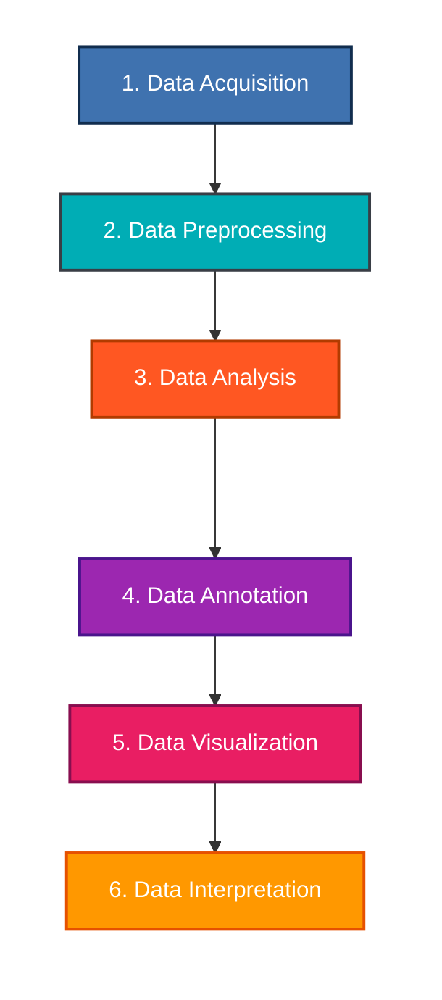
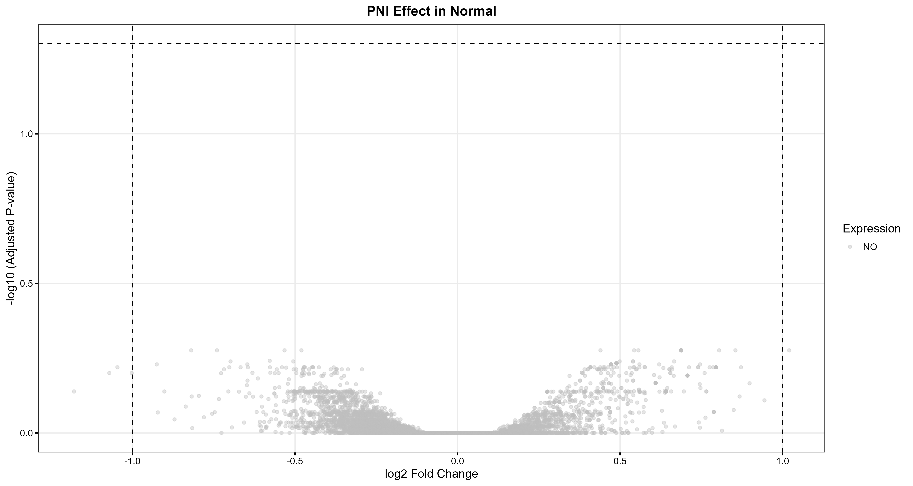
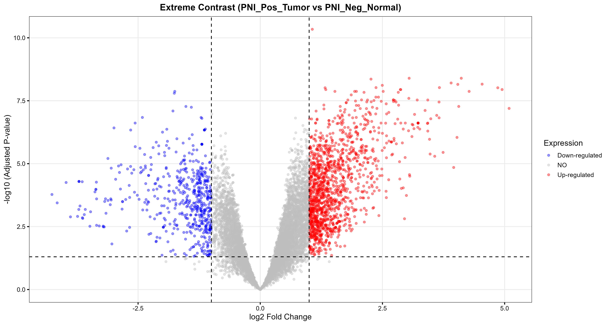
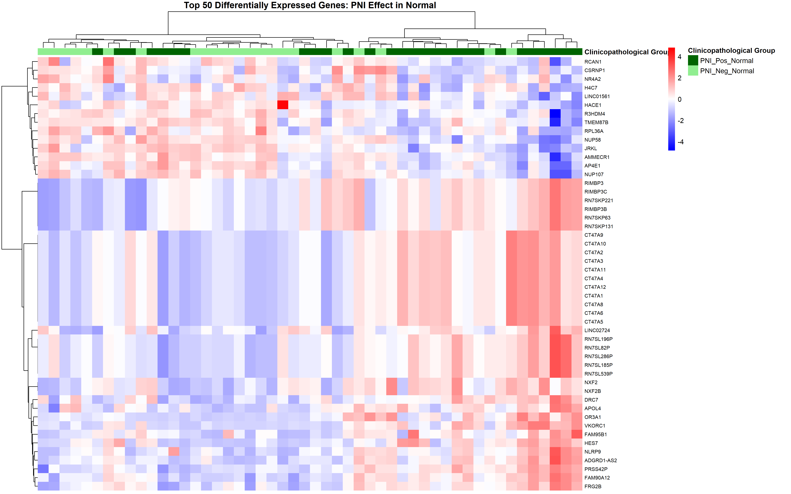
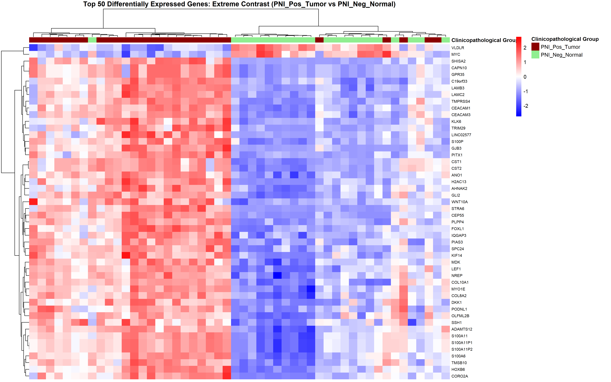
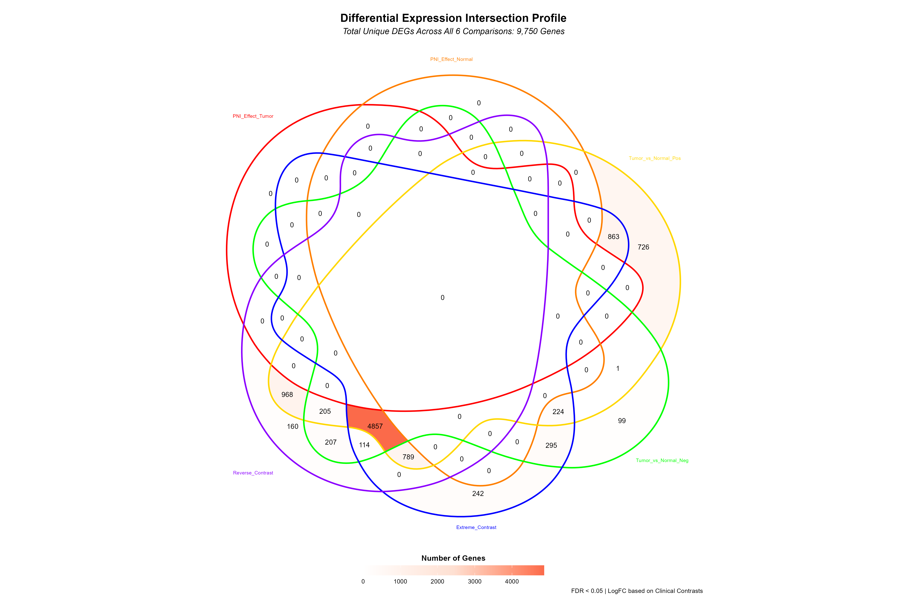
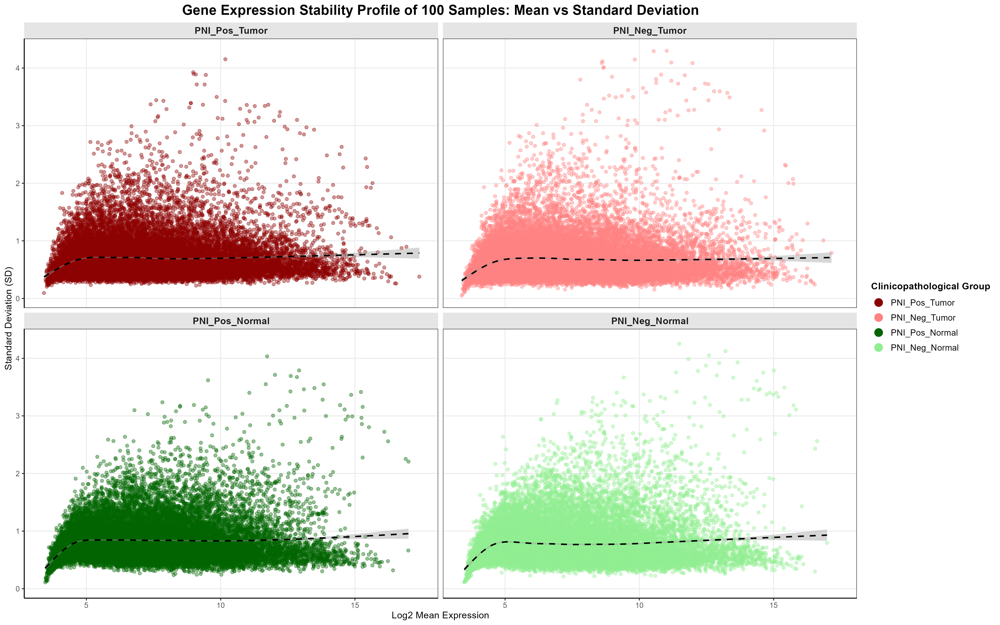
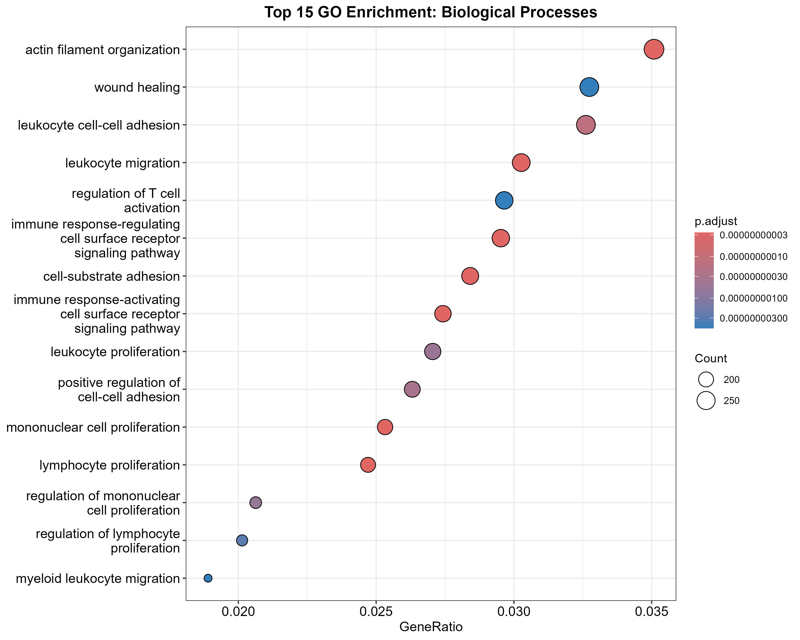
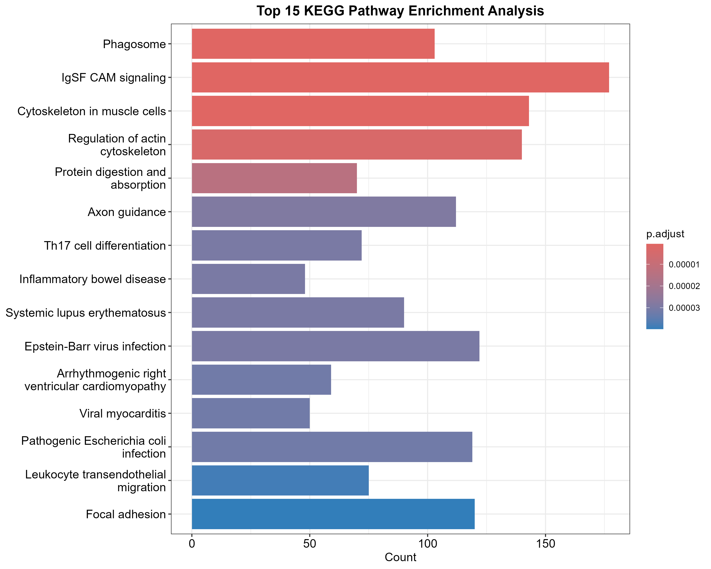

<div align="center">

# Integrative Transcriptomic Profiling of Perineural Invasion (PNI) Signatures in Pancreatic Ductal Adenocarcinoma (PDAC): a Multi-Contrast Bioinformatics Study
**Author:** Yosia Jose Rasdiva Manurung  
**Affiliation:** Diponegoro University

<!-- Badge Section -->
[](https://github.com/JoseManurung/PDAC-PNI-Transcriptomics-Analysis/search?l=r)
[](https://cran.r-project.org/bin/windows/base/old/4.5.2/)
[](LICENSE)
[](https://github.com/JoseManurung/PDAC-PNI-Transcriptomics-Analysis/releases)
[](https://doi.org/10.5281/zenodo.21870889)

<!-- Badge Section -->
[](Script/Coding_GSE102238.R)
[](Script/Coding_GSE102238.R)
[](https://github.com/JoseManurung/PDAC-PNI-Transcriptomics-Analysis/commits/main)

</div>

---

## Repository Structure

```text
PDAC-PNI-Transcriptomics-Analysis/
├── Dataset/         # Curated expression matrix and metadata from GSE102238
├── Results/
│   ├── Data_Tables/ # Statistical output of DEGs (CSV/Excel tables)
│   └── Plots/       # Visualizations (box plot, density plot, UMAP plot, volcano plots, heatmaps, scatter plot, venn diagram, dot plot, and bar plot)
├── Script/          # Core analytical engine containing end-to-end R scripts for the entire bioinformatics workflow, from raw GEO data to biological interpretation
├── .gitignore       # Git exclusion rules for temporary/system files
├── CITATION.cff     # Academic citation metadata for the repository and DOI
├── LICENSE          # MIT open-source licensing agreement
└── README.md        # Comprehensive project documentation and execution guide
```

---

## 1. Project Overview
**Pancreatic ductal adenocarcinoma (PDAC)** is one of the most aggressive malignancies worldwide, characterized by late-stage diagnosis and high therapeutic resistance. A defining hallmark of its progression is **perineural invasion (PNI)** a process where cancer cells infiltrate the neural network, driving debilitating pain and clinical recurrence.

Rather than simple physical infiltration, PNI represents a complex molecular reprogramming of the **tumor microenvironment (TME)** ([Chen et al., 2023](https://doi.org/10.3390/cancers15051360); [Sarantis et al., 2020](https://doi.org/10.4251/wjgo.v12.i2.173); [Sun et al., 2024](https://doi.org/10.3389/fonc.2024.1421067)).

This study utilizes the **GSE102238 dataset** ([Yang et al., 2020](https://doi.org/10.1158/0008-5472.CAN-19-2689)) to systematically map the bidirectional signaling loop between malignant cells and the peripheral nervous system, aiming to identify unique transcriptomic signatures that could serve as novel therapeutic targets.

---

## 2. Research Objectives & Comparison Groups
The primary goal of this study is to identify Differentially Expressed Genes (DEGs) across **six PNI-related clinical contrasts**. This systematic approach allows me to isolate the specific transcriptomic signatures driven by neural invasion versus those driven by general tumorigenesis.

### Contrasts Explored:
1.  **PNI Effect (Tumor):** PNI-positive Tumor vs. PNI-negative Tumor
2.  **PNI Effect (Normal):** PNI-positive Normal vs. PNI-negative Normal
3.  **Tumor vs. Normal (+):** PNI-positive Tumor vs. PNI-positive Normal
4.  **Tumor vs. Normal (-):** PNI-negative Tumor vs. PNI-negative Normal
5.  **Extreme Contrast:** PNI-positive Tumor vs. PNI-negative Normal
6.  **Reverse Contrast:** PNI-negative Tumor vs. PNI-positive Normal

---

## 3. Methodology & Workflow
The analysis was conducted using [R (v4.5.2)](https://cran.r-project.org/bin/windows/base/old/4.5.2/). The integrated pipeline combines data acquisition, rigorous preprocessing, and functional interpretation as follows:

### 3.1. Analysis Pipeline
1.  **Data Acquisition:** Retrieval of raw data via `GEOquery`.
2.  **Data Preprocessing:** Conditional $\log_2$ transformation using `log2()` and quantile distribution evaluation via `quantile()` to stabilize expression signal ranges.
3.  **Data Analysis:** Modeled using the `limma` package across six distinct clinical contrasts.
4.  **Data Annotation:** Systematic mapping of probes to HGNC Symbols via `biomaRt` and relational merging with platform metadata.
5.  **Data Visualization:** Generation of high-fidelity plots to assess data distribution and DEG significance:
    * **Box Plot:** `ggplot()` with `stat_boxplot()` and `geom_boxplot()` to evaluate cross-sample intensity distribution.
    * **Density Plot:** `ggplot()` with `geom_density()` to inspect overall expression profile shapes and normalization symmetry.
    * **UMAP Plot:** `umap()` algorithm followed by `geom_point()` to visualize 2D sample clustering.
    * **Volcano Plot:** Custom function `make_volcano()` mapping $\log_2\text{FC}$ vs. $-\log_{10}(\text{Adjusted } P\text{-value})$.
    * **Heatmap:** `pheatmap()` using Global ANOVA and Ward.D2 clustering for top 50 DEGs.
    * **Scatter Plot:** `ggplot()` with `geom_smooth(method = "gam")` to profile gene expression stability (Mean vs. SD) across clinical cohorts.
    * **Venn Diagram:** `ggVennDiagram()` with a 6-set elliptical layout (`shape_id = "601"`) to identify core biomarkers across all clinical contrasts.
6.  **Data Interpretation:** Functional enrichment analysis to elucidate biological mechanisms:
    * **ID Conversion:** `bitr()` from `clusterProfiler` using `org.Hs.eg.db` to map HGNC Symbols to Entrez IDs.
    * **Gene Ontology (GO):** `enrichGO()` focusing on Biological Processes (`ont = "BP"`) with Benjamini-Hochberg (`BH`) $p$-value adjustment.
    * **Kyoto Encyclopedia of Genes and Genomes (KEGG):** `enrichKEGG()` for *Homo sapiens* (`organism = 'hsa'`) to identify metabolic and signaling pathway alterations.

### 3.2. Pipeline Workflow
Below is the visual representation of the analytical steps performed in this project:

```mermaid
graph TD
    %% Top Row: Steps 1 to 4 (Flowing Left to Right)
    subgraph Row1 [ ]
        direction LR
        S1["1. Data Acquisition"] --> S2["2. Data Preprocessing"]
        S2 --> S3["3. Data Analysis"]
    end

    %% Vertical connector from Step 3 down to Step 4
    S3 --> S4

    %% Bottom Row: Steps 4 to 6 (Flowing Right to Left)
    subgraph Row2 [ ]
        direction LR
        S4["4. Data Annotation"] --> S5["5. Data Visualization"]
        S5 --> S6["6. Data Interpretation"]
    end

    %% Creative Colorful Styling for Each Step
    style S1 fill:#3f72af,color:#fff,stroke:#112d4e,stroke-width:2px
    style S2 fill:#00adb5,color:#fff,stroke:#393e46,stroke-width:2px
    style S3 fill:#ff5722,color:#fff,stroke:#b23b00,stroke-width:2px
    style S4 fill:#9c27b0,color:#fff,stroke:#4a148c,stroke-width:2px
    style S5 fill:#e91e63,color:#fff,stroke:#880e4f,stroke-width:2px
    style S6 fill:#ff9800,color:#fff,stroke:#e65100,stroke-width:2px

    %% Remove subgraph borders and background for a clean layout
    style Row1 fill:transparent,stroke:none
    style Row2 fill:transparent,stroke:none
```

---

## 4. Key Findings

### 4.1. Transcriptomic Stability vs. Eruption
To illustrate the extreme variance in gene expression, this analysis compares highly stable transcriptomic profiles against those undergoing massive dysregulation ("eruption"):

| **Condition: Stability** (Normal Tissue) | **Condition: Eruption** (Extreme Contrast) |
| :---: | :---: |
|  |  |
| *Stability Example: The PNI effect within normal tissues shows minimal differential expression.* | *Eruption Example: The Extreme Contrast reveals massive gene activation and suppression.* |

* **Key Insight:** PDAC maintains high transcriptomic stability at the tissue level, particularly within normal cohorts. However, it undergoes a massive "expression eruption" when transitioning from a basal normal state to a malignant, nerve-involved (PNI-positive) state.
* **Biological Significance:** This suggests that while Neural Invasion is a critical clinical marker, the most profound molecular shifts are driven by the synergy between malignancy and the perineural environment.

### 4.2. Global Expression Profiling (Heatmaps)
The heatmaps illustrate the contrast between homeostatic stability and significant clinical divergence across the 100-sample cohort:

| **Condition: Stability** (Normal Tissue) | **Condition: Eruption** (Extreme Contrast) |
| :---: | :---: |
|  |  |
| *H2: Minimal expression variance in normal tissues regardless of PNI status.* | *H5: Distinct bifurcated expression patterns in PNI-Pos Tumor vs PNI-Neg Normal.* |

* **Clustering Insight:** Hierarchical clustering in **H2** confirms that PNI status does not disrupt the basal transcriptomic state of normal tissues. 
* **Malignancy Signature:** **H5** demonstrates a clear molecular signature that separates aggressive PNI-positive tumors from healthy controls, highlighting the "eruption" of differentially expressed genes.

### 4.3. Biomarker Identification & Stability Analysis
To isolate the core genetic drivers, I intersected multiple clinical contrasts and verified expression stability:

| **Core Biomarker Intersection** | **Expression Stability Profile** |
| :---: | :---: |
|  |  |
| *Venn diagram identifying 9,750 unique DEGs across all 6 clinical contrasts.* | *Mean vs SD Scatter plot visualizing gene stability with GAM smoothing.* |

* **Robust Intersection:** The 6-set Venn diagram allows for the identification of consistently dysregulated genes across all clinical scenarios.
* **High-Confidence Biomarkers:** Key upregulated genes identified through this pipeline include **CEACAM5, S100P, CST2,** and **TMPRSS4**.
* **Stability Verification:** The scatter plot confirms that while most genes remain stable (low SD), a subset of high-variance genes drives the clinical differences observed in PDAC.

### 4.4. Functional Enrichment Analysis (GO & KEGG)
The biological roles of the core biomarkers were analyzed to link gene expression to clinical phenotypes:

| **Gene Ontology (GO)** | **Kyoto Encyclopedia of Genes and Genomes (KEGG)** |
| :---: | :---: |
|  |  |
| *Dot plot highlighting Leukocyte Adhesion and T-cell Activation.* | *Bar plot showcasing IgSF CAM signaling and Axon Guidance.* |

* **Immune Response & Adhesion:** Significant enrichment in **Leukocyte cell-cell adhesion** and **T-cell activation** suggests a strong immune-modulatory component in the PDAC microenvironment.
* **Neural & Signaling Links:** KEGG analysis identifies **Axon Guidance** and **IgSF CAM signaling** as key pathways, providing a molecular basis for how tumor cells interact with neural structures during PNI.

---

## 5. Conclusion
This study provides a high-resolution transcriptomic map of **PNI** in **PDAC**. By systematically dissecting six clinicopathological contrasts, I have established several key conclusions:

* **Malignancy Overrides Localization:** The transcriptomic landscape is dominated by a robust malignant signal that remains consistent regardless of localized neural involvement. The primary oncogenic "engine" of PDAC is the main driver of the observed mRNA profiles.
* **The "Eruption" Signature:** While PNI-only contrasts show high homeostatic stability, the transition from normal to malignant PNI-positive states triggers a massive molecular "eruption." This is evidenced by a core consensus signature of **4,857 shared DEGs**, including high-confidence biomarkers such as **CEACAM5, S100P, CST2,** and **TMPRSS4**.
* **Molecular Hijacking:** Functional enrichment confirms that tumor cells do not move randomly; they actively exploit **Axon Guidance** and **IgSF CAM signaling** to infiltrate the peripheral nervous system. 
* **Immune-Adhesion Crosstalk:** The convergence of **Leukocyte cell-cell adhesion** and **T-cell activation** pathways suggests that PNI is an immune-active process, characterized by complex bidirectional crosstalk between malignant cells and the inflammatory **TME**.

### Summary Impact
This research establishes a computational foundation for discovering novel diagnostic markers and therapeutic targets. By identifying the molecular pillars driving both PDAC progression and neural recruitment, these findings offer a roadmap for future studies aimed at disrupting the pathways that drive clinical recurrence and patient morbidity.

---

## 6. References
> Chen, Z., Fang, Y., & Jiang, W. (2023). Important Cells and Factors from Tumor Microenvironment Participated in Perineural Invasion. Cancers, 15(5), 1360. https://doi.org/10.3390/cancers15051360.

> Sarantis, P., Koustas, E., Papadimitropoulou, A., Papavassiliou, A. G., & Karamouzis, M. V. (2020). Pancreatic ductal adenocarcinoma: Treatment hurdles, tumor microenvironment and immunotherapy. World journal of gastrointestinal oncology, 12(2), 173–181. https://doi.org/10.4251/wjgo.v12.i2.173.

> Sun, Y., Jiang, W., Liao, X., & Wang, D. (2024). Hallmarks of perineural invasion in pancreatic ductal adenocarcinoma: new biological dimensions. Frontiers in Oncology, 14, 1421067. Sec. https://doi.org/10.3389/fonc.2024.1421067.

> Yang, M. W., Tao, L. Y., Jiang, Y. S., Yang, J. Y., Huo, Y. M., Liu, D. J., ... & Sun, Y. W. (2020). Perineural invasion reprograms the immune microenvironment through cholinergic signaling in pancreatic ductal adenocarcinoma. Cancer research, 80(10), 1991-2003. https://doi.org/10.1158/0008-5472.CAN-19-2689.

---

## Citation
If you use this repository, datasets, or analytical pipelines in your academic research, please cite it using the metadata provided below:

> Manurung, Y. J. R. (2026). Integrative Transcriptomic Profiling of Perineural Invasion (PNI) Signatures in Pancreatic Ductal Adenocarcinoma (PDAC): a Multi-Contrast Bioinformatics Study (Version 1.0.2) [Data set]. https://github.com/JoseManurung/PDAC-PNI-Transcriptomics-Analysis

```bibtex
@misc{Manurung_Integrative_Transcriptomic_Profiling_2026,
author = {Manurung, Yosia Jose Rasdiva},
month = aug,
title = {{Integrative Transcriptomic Profiling of Perineural Invasion (PNI) Signatures in Pancreatic Ductal Adenocarcinoma (PDAC): a Multi-Contrast Bioinformatics Study}},
url = {https://github.com/JoseManurung/PDAC-PNI-Transcriptomics-Analysis},
year = {2026}
}
```

---

© 2026 Yosia Jose Rasdiva Manurung. All Rights Reserved.
